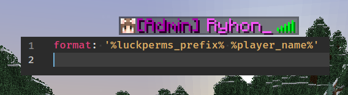

# Just Placeholder Tablist
## Usage
* Compile the plugin
* Put it in your `plugins` directory
* Download [PlaceholderAPI](https://www.spigotmc.org/resources/placeholderapi.6245/), if you haven't already
* Restart/reload server
* Modify `plugins/JustPlaceholderTab/config.yml` to your liking
* Use the `/reloadtablist` to reload the tablist format

## Troubleshooting
### 